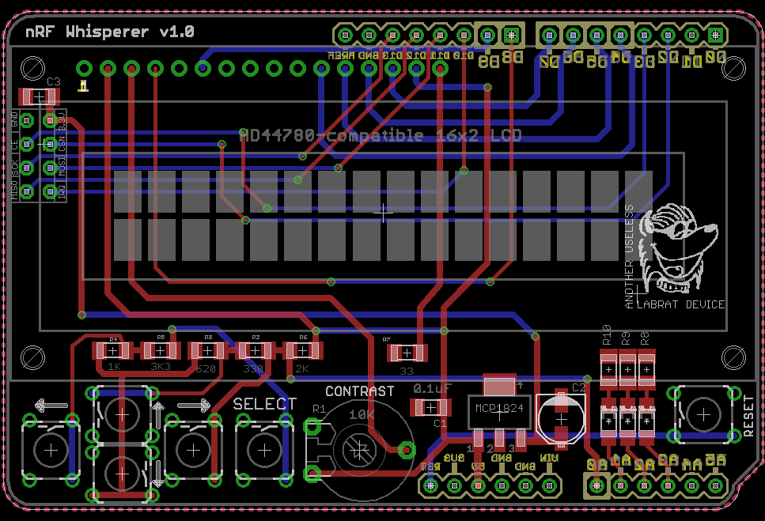
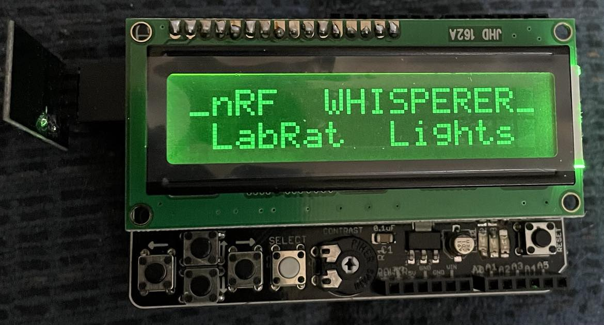

nRFWhisperer: an arduino shield
===============================

This is a custom arduino shield, that integrates a common LCD & Keypad design, with a SPI interface to a nRF24L01 radio module. 
The nRFWhisperer was designed to provide sanity tests for nRF24L01 modules, and interacts with WNRF E1.31 gateway device.  The nRFWhisper can also operate as a serial interface for the PIC wireless bootloader.  [nRFLoader](https://github.com/LabRat3K/nRFLoader/blob/main/Documentation/nRFLoader.pdf)

## Dependencies

This project makes use of the following libraries:
 - [LRL_KEY](https://github.com/LabRat3K/LRL_Key) library for integrating the keypad.
 - [RF24](https://nrf24.github.io/RF24/) library for interfacing with the nRF24L01 (can be downloaded using the Arduino library manager)

## License

The contents of this repository, including the pcb schematic, and the sample code, is released under a [3-clause BSD license](LICENSE). If you use this project, for commercial or non-commercial use, linking to this GitHub page is strongly recommended. 

## Credits

Written by Andrew Williams.
Another Useless Labrat Project.

